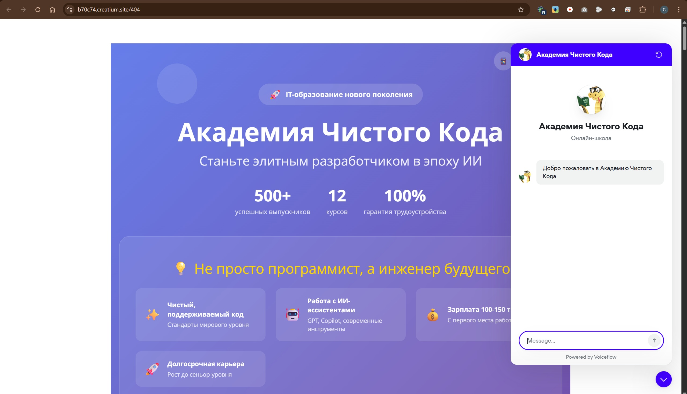
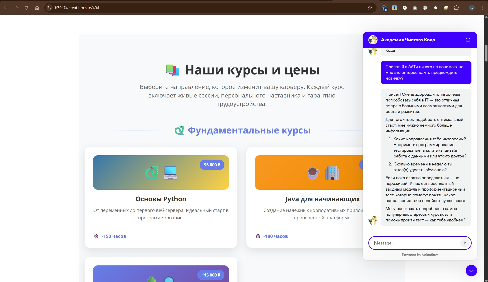
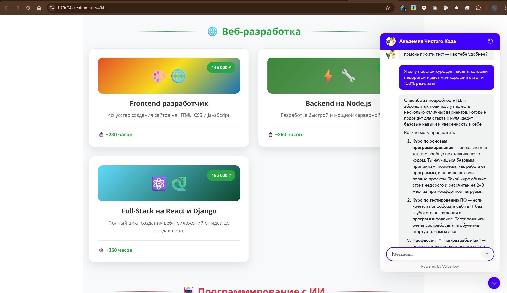
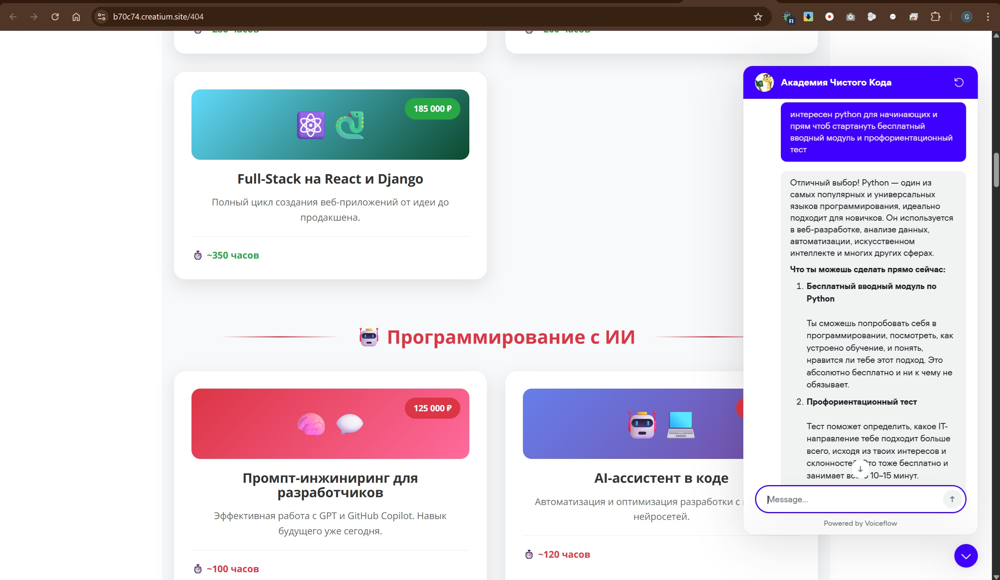
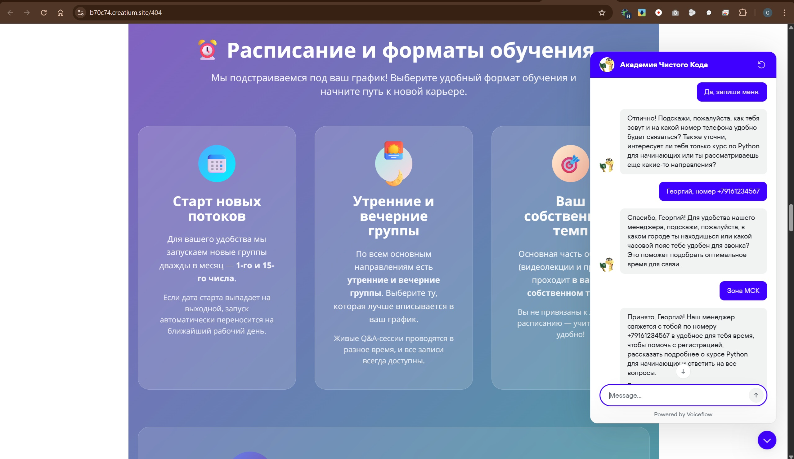
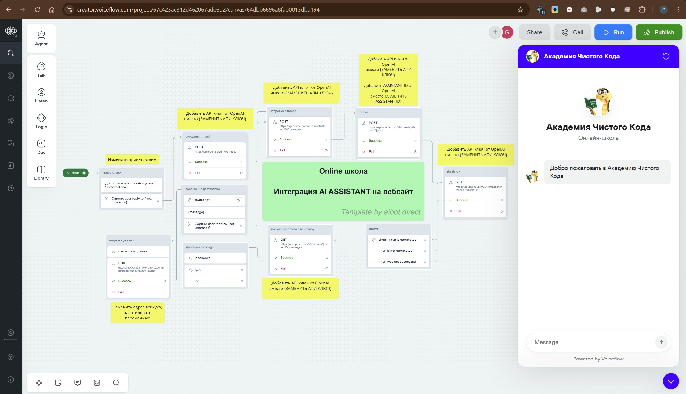

## Сайт онлайн‑школы с ИИ‑консультантом (Voiceflow)

Коротко: одностраничный сайт онлайн‑школы с виджетом ИИ‑консультанта, созданного в Voiceflow, для ответов на вопросы, рекомендаций курсов и сбора заявок.

### Ссылки
- **Демо сайта**: [https://b70c74.creatium.site/404](https://b70c74.creatium.site/404)
- **Проект Voiceflow**: [Схема ассистента](https://creator.voiceflow.com/project/67c423ac312d462067ade6d2/canvas/64dbb6696a8fab0013dba194)
- **Репозиторий GitHub**: [https://github.com/ergon73/online-school-ai-assistant](https://github.com/ergon73/online-school-ai-assistant)

### Скриншоты (из каталога проекта)














### Артефакты ассистента (для ревью)
- Системный промпт: `improved_system_prompt.txt`
- База знаний (пример): `knowledge_base_v2.md`

Эти файлы добавлены в репозиторий осознанно для демонстрации навыков промпт‑инжиниринга и подготовки базы знаний. В прод‑проектах храните секреты и внутренние данные отдельно и не раскрывайте приватные материалы.

### Функциональность
- Ответы на FAQ: цена, формат, расписание, продолжительность.
- Рекомендации курса на основе интересов пользователя.
- Сбор и передача заявок (лид‑форма внутри диалога, возможна интеграция с CRM).
- Возможность подключения базы знаний.

### Архитектура (высокоуровнево)
- Веб‑сайт на конструкторе (Creatium/Tilda) с встраиваемым виджетом.
- ИИ‑ассистент на Voiceflow (NLP + логика диалога + интеграции).
- (Опционально) API OpenAI / внешние базы знаний / CRM.

### Технологии
- Voiceflow (диалоговая логика, ассистент/чат‑виджет)
- Конструктор сайта: Creatium (или Tilda)
- (Опционально) OpenAI API для генеративных ответов
- (Опционально) CRM‑интеграция (AmoCRM/Albato/Make/Zapier)

### Встраивание виджета Voiceflow в сайт
Вставьте HTML/JS‑код виджета в блок на странице конструктора ("Вставка кода"):

```html
<!-- Voiceflow Chat Widget -->
<script type="module" src="https://cdn.voiceflow.com/widget/bundle.mjs"></script>
<script>
  window.voiceflow = window.voiceflow || {};
  window.voiceflow.chat = window.voiceflow.chat || {};
  window.voiceflow.chat.load({
    verify: { projectID: "<VOICEFLOW_PROJECT_ID>" },
    url: "https://general-runtime.voiceflow.com",
    versionID: "<VOICEFLOW_VERSION_ID>"
  });
</script>
```

### Настройка ассистента в Voiceflow
- Импортируйте/создайте ассистента.
- Проверьте блоки: приветствие, FAQ, рекомендации, сбор заявки.
- Замените ключи/ID на свои.
- Протестируйте в тестовом чате Voiceflow.

### Тест‑чеклист
- Виджет грузится на сайте и доступен на всех целевых страницах.
- Ассистент отвечает на FAQ корректно.
- Ветка рекомендаций приводит к релевантным курсам.
- Форма заявки собирает имя/контакты и отправляет данные (проверьте интеграцию).
- Мобильная верстка корректна.

### Локальные секреты и конфигурация
Если используются ключи API или токены, храните их в локальном `.env` и не коммитьте в репозиторий. На продакшн‑платформе задавайте переменные окружения вручную.

Пример `.env` (не добавляйте в Git):
```bash
OPENAI_API_KEY=...  
VOICEFLOW_PROJECT_ID=...
```

### План развития
- Расширение базы знаний: импорт из Notion/Google Docs.
- Связка с CRM (AmoCRM/Albato/Make) и рассылками.
- Персонализированные воронки по сегментам пользователей.
- A/B‑тесты приветствия и сценариев рекомендаций.

### Лицензия
[Укажите лицензию или оставьте Proprietary]
